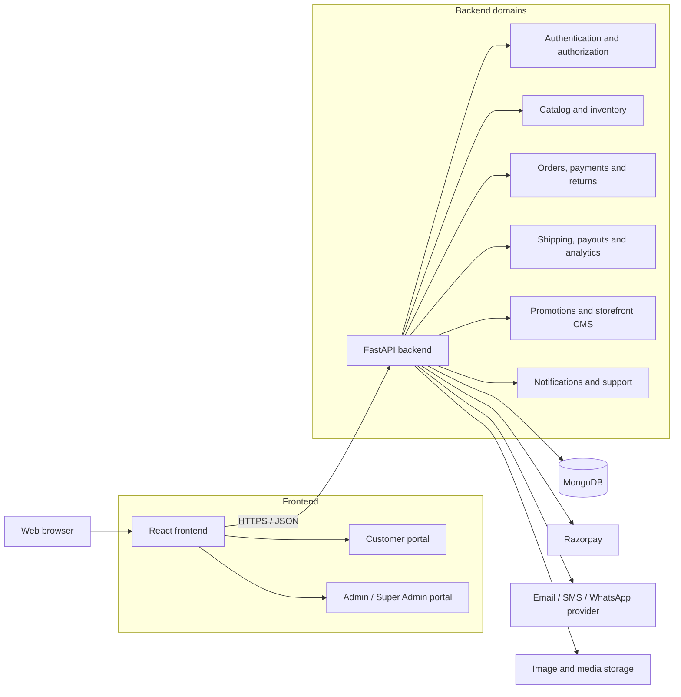
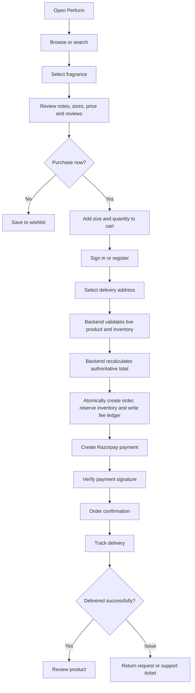
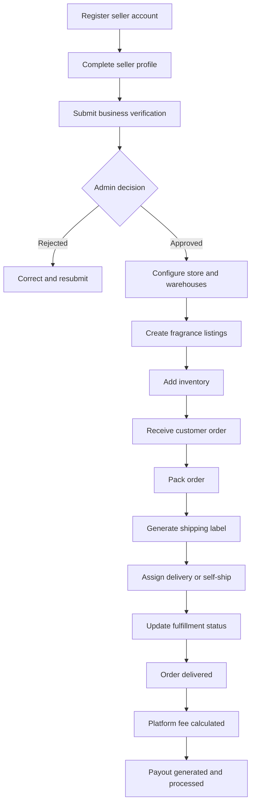
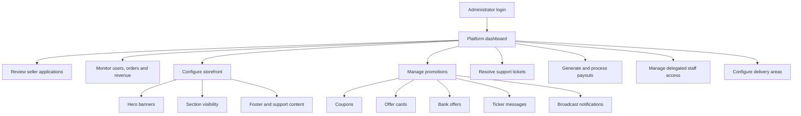
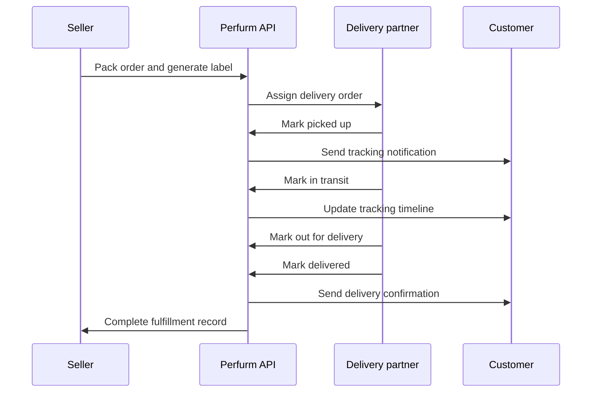
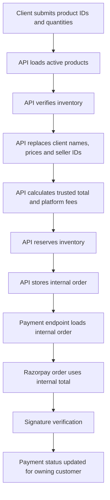

# Perfurm Application Manual

## 1. Application Summary

Perfurm is a single-brand fragrance-commerce platform with three supported application profiles: Customer, Admin, and Super Admin. It covers discovery, cart and checkout, catalogue/inventory operations, fulfilment, tracking, returns, promotions, analytics, privacy operations and customer support. Historical seller/delivery backend models are retained for order and carrier compatibility, but no seller or delivery login portal is exposed.

### Current local services

| Service | URL | Purpose |
|---|---|---|
| Customer and operations web app | http://localhost:3000 | React user interface |
| Backend API | http://localhost:8000 | FastAPI REST service |
| Backend health check | http://localhost:8000/health | Service readiness and environment |
| Backend readiness | http://localhost:8000/ready | Database and background-worker readiness |
| Prometheus metrics | http://localhost:8000/metrics | Operational counters and backlog gauges |
| Interactive API documentation | http://localhost:8000/docs | Swagger/OpenAPI explorer |
| Alternative API documentation | http://localhost:8000/redoc | ReDoc reference |

The current local backend uses an in-memory Mongo-compatible preview database when `USE_MOCK_DB=true`. Restarting the backend resets preview data.

### Local preview accounts

These accounts are seeded only when `USE_MOCK_DB=true` and must never be enabled in staging or production.

| Role | Email | Password |
|---|---|---|
| Customer | `customer@example.com` | `customer123` |
| Super administrator | `admin@perfurm.com` | `admin123` |

Sign in at http://localhost:3000/auth. Authentication uses a short-lived access token in memory and a rotating HttpOnly refresh cookie, so cookies must be enabled in the browser.

## 2. Product Vision

Perfurm is positioned as a curated fragrance marketplace rather than a generic ecommerce store. Its customer experience focuses on:

- Fragrance discovery by audience and scent family
- Premium editorial presentation
- Discovery sets and gifting
- Multi-seller product availability
- Authenticity, order visibility, and post-purchase support

Primary catalog areas include For Him, For Her, Unisex, Home Scents, Discovery Sets, Gifting, New Arrivals, and Sale.

## 3. User Roles

| Role | Primary responsibility | Main route |
|---|---|---|
| Customer | Discover and purchase fragrances | `/` and `/customer/*` |
| Administrator | Operate catalogue, inventory, orders, customers and CMS | `/admin/*` |
| Super Admin | All Admin capabilities plus staff, privacy, configuration and oversight | `/admin/*` |

Only customers may self-register. Admin accounts are provisioned by Super Admin; the initial Super Admin is bootstrapped through controlled deployment data.

## 4. System Architecture



### Technology stack

| Layer | Technology |
|---|---|
| Web application | React 19 and React Router |
| UI | Tailwind CSS, Radix UI primitives, Lucide icons |
| Motion | Framer Motion and custom CSS animations |
| HTTP client | Axios |
| Charts | Recharts |
| API | FastAPI and Pydantic |
| Database | MongoDB using Motor/PyMongo |
| Authentication | JWT bearer tokens and bcrypt password hashing |
| Payments | Razorpay integration |
| Tests | Pytest and FastAPI TestClient |

## 5. Customer Journey



### Customer capabilities

- Search suggestions and full product search
- Category browsing, filters, and sorting
- Trending, most-viewed, bestseller, and related products
- Product images, videos, specifications, notes, sizes, and reviews
- Wishlist, recently viewed products, and local cart
- Address management and pincode checks
- Coupon validation and promotional offers
- Server-authoritative coupon redemption with global/per-customer limits and cancellation-safe release
- Policy-aware return/replacement/cancellation requests with an administrator queue, status history, refund boundaries, and explicit restock or damaged-stock disposition
- Razorpay checkout
- Order history and delivery tracking
- Return requests
- Profiles, settings, notification preferences, and support tickets

## 6. Legacy Fulfilment Data Model

This section documents internal compatibility only. Seller and delivery frontend routes redirect away and these profiles cannot self-register. Perfurm Admin performs catalogue, inventory, order, refund and shipping operations for the single operating business. Carrier movement is received through the signed shipping-provider webhook.

### Historical marketplace flow (not an exposed portal)



### Seller capabilities

- Seller onboarding and approval status
- Business verification data
- Store profile and public storefront
- Product CRUD with perfume taxonomy, scent notes, media, regulatory details and SEO
- Size variants with unique SKUs and authoritative initial-stock synchronization
- Inventory and low-stock thresholds
- Warehouse management
- Seller order views and status updates
- Shipping labels, tracking identifiers, and barcodes
- Return and replacement policy configuration
- Analytics, performance metrics, fees, earnings, and payouts

## 7. Administrator Journey



### Administrator capabilities

- Seller approval and business verification
- Platform analytics and seller revenue reporting
- Seller payout generation and processing
- Coupon and bank-offer management
- Hero banners, offer cards, ticker messages, and broadcasts
- External notification outbox health, retries and dead-letter visibility
- Storefront section visibility
- Footer, support, tax, fee, and platform settings
- Support-ticket assignment and responses
- Responsive order search, payment-state review, and idempotent refund initiation
- Delegated administrator roles, activation controls, and permission-aware navigation
- Pincode serviceability, delivery timing, COD eligibility, and shipping charges

## 8. Carrier Delivery Flow



## 9. Frontend Route Reference

### Public and customer routes

| Route | Screen |
|---|---|
| `/` | Perfurm homepage |
| `/auth` | Login, registration, OTP, and password reset |
| `/customer/search` | Search results |
| `/customer/category/:category` | Category listing and filters |
| `/customer/product/:id` | Product details |
| `/customer/cart` | Shopping cart |
| `/customer/wishlist` | Wishlist |
| `/customer/checkout` | Address, order, and payment flow |
| `/customer/orders` | Customer order history |
| `/customer/orders/:orderId/track` | Delivery tracking |
| `/customer/orders/:orderId/return` | Return request |
| `/customer/profile` | Profile and addresses |
| `/customer/settings` | Preferences and account settings |
| `/customer/support` | FAQs and support tickets |

### Seller routes

| Route | Screen |
|---|---|
| `/seller` | Seller dashboard |
| `/seller/setup` | Seller onboarding |
| `/seller/products` | Product management |
| `/seller/inventory` | Inventory management |
| `/seller/orders` | Order fulfillment |
| `/seller/analytics` | Seller analytics |
| `/seller/payouts` | Earnings and payouts |
| `/seller/warehouses` | Warehouse management |
| `/seller/business-verification` | Verification details |
| `/seller/performance` | Performance metrics |
| `/seller/return-policy` | Return-policy settings |
| `/seller/store` | Store profile |

### Administrator routes

| Route | Screen |
|---|---|
| `/admin` | Admin dashboard |
| `/admin/sellers` | Seller approvals |
| `/admin/analytics` | Platform analytics |
| `/admin/notifications` | Broadcast notifications |
| `/admin/coupons` | Coupons |
| `/admin/tickets` | Support tickets |
| `/admin/offers` | Promotional cards |
| `/admin/bank-offers` | Bank offers |
| `/admin/footer` | Footer content |
| `/admin/settings` | Platform configuration |
| `/admin/payouts` | Seller payouts |
| `/admin/orders` | Orders and refunds |
| `/admin/catalogue` | Cross-seller activation and merchandising |
| `/admin/staff` | Delegated administrator access |
| `/admin/serviceability` | Delivery-area and pincode rules |
| `/admin/storefront` | Section visibility |
| `/admin/banners` | Hero banners |

## 10. Backend API Reference

The full generated reference is available at `http://localhost:8000/docs`.

| Domain | Route prefix and examples |
|---|---|
| Authentication | `/api/auth/register`, `/login`, `/me`, OTP and reset routes |
| Sellers | `/api/sellers/*`, `/api/admin/sellers/*` |
| Products | `/api/products`, trending, most viewed, similar, bestsellers |
| Search | `/api/search`, `/api/search/suggestions` |
| Inventory | `/api/inventory/*` |
| Orders | `/api/orders/*` |
| Payments | `/api/payments/*` |
| Reviews | `/api/reviews/*` |
| Addresses | `/api/addresses/*`, `/api/pincode/*` |
| Shipping | `/api/warehouses/*`, `/api/shipping-labels/*`, tracking routes |
| Returns | `/api/return-policy/*`, `/api/return-requests/*` |
| Delivery | `/api/delivery-partners/*`, `/api/delivery-status/*` |
| Payouts and fees | `/api/admin/seller-payouts`, `/api/seller/payouts`, fee routes |
| Promotions | coupons, ticker, hero banners, offer cards, and bank offers |
| Storefront CMS | visibility, footer content, platform and support settings |
| Notifications | user notifications, preferences, and admin broadcasts |
| Support | `/api/tickets/*` and `/api/support/*` |
| Analytics | seller and administrator analytics routes |

## 11. Order and Payment Integrity



The API must never trust prices, totals, seller IDs, payment ownership, or order status supplied by the browser.

### Authoritative checkout, GST and invoices

Checkout calls `POST /api/checkout/quote` whenever the address, cart variant, or coupon changes. Product and variant prices, inventory, coupon limits, serviceability, shipping, and GST are recalculated by the API; values submitted by the browser are never trusted. These values are snapshotted on the order.

GST is configured centrally with `TAX_PRICES_INCLUDE_GST` and `TAX_ORIGIN_STATE`. Same-state orders split tax into CGST/SGST; other states use IGST. Customers and authorized operations staff can generate and download immutable seller-level tax invoices from the Orders screen. Legacy orders without an authoritative tax snapshot remain invoice-ineligible until finance reviews them.

Before enabling invoices, configure the root `.env`, verify every taxable production seller's GSTIN and legal address, back up MongoDB, dry-run `python backend/migrations/007_tax_invoices.py`, and then apply it with `--apply`.

## 12. Security Model

- Passwords are hashed with bcrypt.
- JWTs contain the user identifier, role, and expiration.
- Protected routes validate the bearer token.
- Role dependencies protect customer, Admin and Super Admin operations; legacy fulfilment APIs remain non-public and role-gated.
- Public registration only permits the customer role.
- Order, payment, and delivery access is ownership-checked.
- OTP values are not returned unless `ENABLE_DEMO_OTP=true` is explicitly configured.
- The application refuses to start without `JWT_SECRET_KEY`.
- Production CORS origins must be explicitly configured.

For production, use HTTPS, a managed secret store, MongoDB replica-set backups, configured email/SMS delivery, signed payment/shipping webhooks, uptime/metrics alerts and a reviewed media policy.

## 13. Environment Configuration

### Backend `.env`

```env
MONGO_URL=mongodb://localhost:27017
DB_NAME=perfurm
JWT_SECRET_KEY=replace-with-a-long-random-secret
CORS_ORIGINS=http://localhost:3000
RAZORPAY_KEY_ID=
RAZORPAY_KEY_SECRET=
RAZORPAY_WEBHOOK_SECRET=
PUBLIC_SITE_URL=http://localhost:3000
PUBLIC_API_URL=http://localhost:8000
SHIPPING_PROVIDER_API_URL=
SHIPPING_PROVIDER_API_TOKEN=
SHIPPING_PROVIDER_WEBHOOK_SECRET=
REVERSE_GEOCODING_URL=https://api.bigdatacloud.net/data/reverse-geocode-client?latitude={latitude}&longitude={longitude}&localityLanguage=en
SMTP_HOST=
SMTP_PORT=587
SMTP_USERNAME=
SMTP_PASSWORD=
SMTP_FROM_EMAIL=
SMS_WEBHOOK_URL=
SMS_WEBHOOK_TOKEN=
METRICS_TOKEN=
USE_MOCK_DB=false
ENABLE_DEMO_OTP=false
```

### Frontend `.env`

```env
REACT_APP_BACKEND_URL=http://localhost:8000
```

Environment files are ignored by Git. Commit `.env.example` templates rather than real secrets when sharing configuration requirements.

### External-provider contract

| Capability | Environment variables | Go-live action |
|---|---|---|
| Razorpay | `RAZORPAY_KEY_ID`, `RAZORPAY_KEY_SECRET`, `RAZORPAY_WEBHOOK_SECRET` | Create live keys, register `PUBLIC_API_URL/api/payments/webhook`, subscribe to payment/refund events and test signatures |
| Shipping/carrier | `SHIPPING_PROVIDER_API_URL`, `SHIPPING_PROVIDER_API_TOKEN`, `SHIPPING_PROVIDER_WEBHOOK_SECRET` | Point the label adapter to the carrier, register `PUBLIC_API_URL/api/shipping/webhook`, and qualify duplicate signed events |
| Email | `SMTP_HOST`, `SMTP_PORT`, `SMTP_USE_TLS`/`SMTP_USE_SSL`, username/password/from address | Verify the sending domain and deliver a staging notification before enabling delivery |
| SMS | `SMS_WEBHOOK_URL`, `SMS_WEBHOOK_TOKEN` | Configure an HTTPS adapter accepting the documented notification payload |
| Current location | `REVERSE_GEOCODING_URL` | Keep both coordinate placeholders and confirm provider quota/privacy terms |
| MongoDB | `MONGO_URL`, `DB_NAME` | Use an authenticated replica set with encryption and tested backups |
| Monitoring | `METRICS_TOKEN` | Scrape `/metrics` with bearer authentication and alert on readiness/backlogs |

Admin can inspect secret-free configuration state through `GET /api/admin/integrations/status`. Values are read centrally from environment configuration; changing a provider URL or key does not require editing application code, but backend environment changes require a service restart.

Customer Settings supports password rotation, portable JSON data export and an account-deletion request. Deletion is intentionally an auditable request rather than an immediate destructive operation; active orders block submission and production operations must apply the approved retention/anonymization policy.

Admins with `privacy.manage` review requests under **Admin → Privacy Requests**. Approval calculates the later of the configured grace period and retained-order period and blocks new checkout. Only Super Admin can run irreversible anonymization after eligibility. Configure `ACCOUNT_DELETION_GRACE_DAYS` and `ORDER_PII_RETENTION_DAYS` through the environment; the latter defaults to 2555 days and must be confirmed for the operating jurisdiction.

## 14. Local Development

### Requirements

- Node.js 20 LTS is recommended
- Python 3.11 or 3.12 is recommended
- MongoDB for persistent development data

### Start the backend

```powershell
cd backend
python -m venv .venv
.venv\Scripts\Activate.ps1
pip install -r requirements.txt
python -m uvicorn server:app --reload --port 8000
```

For an in-memory preview without MongoDB, set `USE_MOCK_DB=true`.

### Start the frontend

```powershell
cd frontend
npm install --legacy-peer-deps
npm start
```

### Seed persistent development data

```powershell
cd backend
python seed_data.py
```

Warning: `seed_data.py` clears existing development collections before inserting demo data.

## 15. Loading and Motion System

The Perfurm loader is a CSS-animated fragrance bottle with:

- Rising perfume level
- Moving liquid surface
- Bubbles
- Floating bottle motion
- Glass highlight and breathing aura
- Reduced-motion support

It is used for the storefront, categories, search, and product details. Framer Motion supplies restrained hover, carousel, and section entrance transitions.

## 16. Testing

### Backend security regression tests

```powershell
python -m pytest tests/test_security.py -q
```

The suite verifies:

- Privileged roles cannot self-register
- OTP values are not disclosed by default
- Orders ignore tampered client prices, product names, totals, and seller IDs

### Frontend production build

```powershell
cd frontend
npm run build
```

The build currently completes with React Hook dependency warnings. These warnings should be addressed progressively by stabilizing callback functions with `useCallback` and declaring correct effect dependencies.

## 17. Deployment Checklist

- [ ] Use supported Node and Python versions
- [ ] Set a strong unique JWT secret
- [ ] Disable mock database and demo OTP modes
- [ ] Configure MongoDB authentication, TLS, indexes, and backups
- [ ] Configure exact HTTPS CORS origins
- [ ] Configure Razorpay production credentials and webhooks
- [ ] Configure real email, SMS, or WhatsApp providers
- [ ] Move uploaded media to managed object storage
- [ ] Add rate limiting and abuse protection
- [ ] Add structured logs, error monitoring, and uptime checks
- [ ] Run backend security tests and frontend production build
- [ ] Test customer checkout and refunds in payment sandbox
- [ ] Test seller fulfillment and payout reconciliation
- [ ] Verify privacy policy, terms, returns, shipping, and authenticity content
- [x] Pass automated desktop/tablet/mobile Chromium overflow and serious/critical axe checks
- [ ] Complete physical iOS/Android plus Firefox/WebKit accessibility testing
- [ ] Review all administrator permissions

## 18. Troubleshooting

| Problem | Resolution |
|---|---|
| Port 3000 is already in use | Stop the existing Node process before restarting the frontend |
| Port 8000 is already in use | Stop the existing Uvicorn/Python process |
| Frontend loads but has no products | Verify backend URL and `/api/products`; start MongoDB or enable preview mode |
| Backend waits during startup | MongoDB is unavailable; check `MONGO_URL` or enable `USE_MOCK_DB=true` |
| Razorpay returns 503 | Configure `RAZORPAY_KEY_ID` and `RAZORPAY_KEY_SECRET` |
| Old design remains visible | Perform a hard refresh with `Ctrl + Shift + R` |
| npm dependency conflict | Use Node 20 LTS and `npm install --legacy-peer-deps` |
| Preview data disappears | In-memory mock data resets whenever the backend restarts |

## 19. Important Source Locations

| File | Responsibility |
|---|---|
| `backend/server.py` | FastAPI models, authorization, and API routes |
| `backend/seed_data.py` | Persistent development data seeding |
| `frontend/src/App.js` | Top-level role routing |
| `frontend/src/pages/CustomerPortal.js` | Customer shell and homepage |
| `frontend/src/pages/SellerDashboard.js` | Seller shell and routes |
| `frontend/src/pages/AdminDashboard.js` | Administrator shell and routes |
| `frontend/src/pages/DeliveryPartnerDashboard.js` | Delivery operations |
| `frontend/src/contexts/AuthContext.js` | Frontend authentication state |
| `frontend/src/components/BrandMark.jsx` | Perfurm brand mark |
| `frontend/src/components/BottleLoader.jsx` | Loading animation |
| `tests/test_security.py` | Critical API security regression tests |

## 20. Maintenance Notes

- Keep product and seller data server-authoritative.
- Add a regression test for every authorization defect.
- Do not commit `.env` files, logs, build folders, or dependency directories.
- Keep the OpenAPI contract synchronized with frontend usage.
- Prefer database migrations or controlled scripts over direct production edits.
- Review deprecation warnings before upgrading FastAPI, React, Node, or Python.
